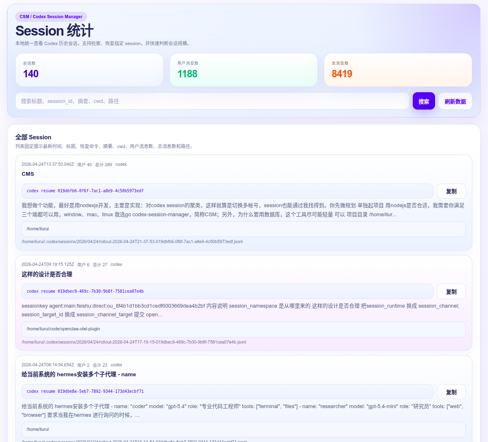

# CSM

[English](./README.md) | 简体中文

`CSM` 是一个轻量的 Codex Session 管理工具，项目名为 `codex-session-manager`。

当前版本：`0.1.0`

它的核心目标很直接：

> 当大家在多个 Codex 账号之间切换后，原来的 session 往往不容易再找到，`CSM` 就是为“找回 session”这件事做的。



`CSM` 用于本地扫描和查看 Codex 历史会话，重点解决这几件事：

- 在多账号切换之后，尽快重新定位历史 session
- 用一个命令快速列出全部 session
- 在本地 Dashboard 中检索、筛选、查看 session 详情
- 展示可直接恢复会话的命令
- 统计用户消息数、总消息数、工作目录和原始文件路径
- 保留 cluster 能力，但不把 cluster 当主入口

## 特性

- Go 实现，支持 Windows、macOS、Linux
- 本地单机使用，不依赖数据库和外部服务
- 数据存储为本地 JSON / JSONL 文件
- 支持多数据源扫描
- 支持 CLI 和本地 Dashboard 两种使用方式
- 支持手工聚类操作：`merge`、`split`、`tag`、`reset`
- session 标题优先读取 Codex 原生命名：
  - `~/.codex/session_index.jsonl` 中的 `thread_name`
  - session 原文件中的 `thread_name_updated`

## 当前主入口

日常最常用的是这两个：

```bash
csm
csm dashboard
```

含义分别是：

- `csm`：自动扫描后直接列出 session
- `csm dashboard`：启动本地 Web 页面查看 session 统计和明细

## 安装

最新安装包可从 GitHub Releases 获取：

`https://github.com/lrwh/codex-session-manager/releases/latest`

请选择对应平台的安装包，并把 `csm` 安装到系统 `PATH` 中。

### Linux

```bash
curl -L -o csm-linux-amd64.tar.gz https://github.com/lrwh/codex-session-manager/releases/latest/download/csm-linux-amd64-0.1.0.tar.gz
tar -xzf csm-linux-amd64.tar.gz
sudo install -m 755 csm-linux-amd64 /usr/local/bin/csm
csm --version
```

### macOS Intel

```bash
curl -L -o csm-darwin-amd64.tar.gz https://github.com/lrwh/codex-session-manager/releases/latest/download/csm-darwin-amd64-0.1.0.tar.gz
tar -xzf csm-darwin-amd64.tar.gz
sudo install -m 755 csm-darwin-amd64 /usr/local/bin/csm
csm --version
```

### macOS Apple Silicon

```bash
curl -L -o csm-darwin-arm64.tar.gz https://github.com/lrwh/codex-session-manager/releases/latest/download/csm-darwin-arm64-0.1.0.tar.gz
tar -xzf csm-darwin-arm64.tar.gz
sudo install -m 755 csm-darwin-arm64 /usr/local/bin/csm
csm --version
```

### Windows

1. 从 Releases 下载 `csm-windows-amd64-0.1.0.zip`
2. 解压后将 `csm-windows-amd64.exe` 重命名为 `csm.exe`
3. 放到固定目录，例如 `C:\Tools\csm\`
4. 把该目录加入 `PATH`
5. 新开终端执行 `csm --version`

## 更新

安装完成后，可直接执行：

```bash
csm update
```

说明：

- Linux 和 macOS 会尝试自动替换当前可执行文件
- Windows 当前会下载最新包，并提示手工替换

## 快速开始

### 1. 初始化

```bash
csm init
```

### 2. 添加 Codex 数据源

```bash
csm source add ~/.codex
csm source list
```

### 3. 扫描 session

```bash
csm scan
```

### 4. 直接列出 session

```bash
csm
csm -n 20
csm --verbose -n 1
csm --json -n 10
```

### 5. 打开 Dashboard

```bash
csm dashboard
csm dashboard --no-open
csm dashboard --addr 127.0.0.1:7788
```

### 6. 搜索和聚类

```bash
csm find 聚类
csm cluster rebuild
csm cluster list -n 20
csm show <cluster-id>
csm tag set <cluster-id> 我的簇
csm cluster merge <target-cluster-id> <source-cluster-id...>
csm cluster split <source-cluster-id> <session-id...>
csm cluster reset <cluster-id>
```

## 从源码构建

源码构建和打包说明见 [BUILD.zh-CN.md](./BUILD.zh-CN.md)。

## 本地数据

默认工作目录：

```text
~/.config/csm
```

可通过环境变量覆盖：

```bash
CSM_HOME=/path/to/csm-home csm
```

主要文件：

- `config.json`
- `sources.json`
- `session_index.jsonl`
- `clusters.json`
- `tags.json`

## 命令概览

```bash
csm
csm sessions
csm init
csm source add <path>
csm source list
csm scan
csm find <query>
csm dashboard
csm update
csm cluster rebuild
csm cluster list
csm cluster merge
csm cluster split
csm cluster reset
csm show <cluster-id>
csm tag set <cluster-id> <name>
csm tag remove <cluster-id>
```

## 说明

- `CSM` 首先是一个“找回 session”的产品，而不是一个复杂的聚类平台
- `CSM` 当前把 session 作为主入口，cluster 作为辅助能力
- session 标题只认 Codex 原生命名，不读取第三方 UI 的本地别名
- 如果某条 session 没有原生命名，才会回退到消息摘要标题

## License

当前仓库未附带正式 License，如需开源发布，建议补充 `MIT` 或 `Apache-2.0`。
